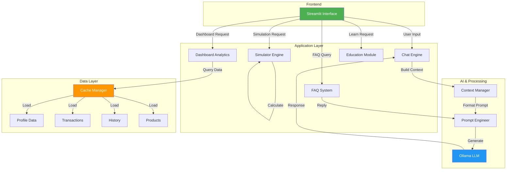

# 🏗️ Arquitetura Técnica - Edu v2.0

## 📐 Visão Geral da Arquitetura



---

## 📁 Estrutura de Diretórios

```
dio-lab-bia-do-futuro/
├── 📄 README.md                    # Documentação principal
├── 📄 GUIA_EXECUCAO.md             # Como rodar a aplicação
├── 📄 TESTES_VALIDACAO.md          # Plano de testes
├── 📄 requirements.txt              # Dependências Python
│
├── 📁 src/
│   └── 📄 app.py                   # Aplicação Streamlit (PRINCIPAL)
│
├── 📁 data/
│   ├── 📄 perfil_investidor.json   # Dados do cliente
│   ├── 📄 transacoes.csv           # Histórico financeiro
│   ├── 📄 historico_atendimento.csv # Interações
│   └── 📄 produtos_financeiros.json # Produtos disponíveis
│
└── 📁 docs/
    ├── 📄 01-documentacao-agente.md
    ├── 📄 02-base-conhecimento.md
    ├── 📄 03-prompts.md
    ├── 📄 04-metricas.md
    └── 📄 05-pitch.md
```

---

## 🔧 Stack Técnico

### Frontend

| Componente    | Versão | Função                    |
| ------------- | ------ | ------------------------- |
| **Streamlit** | 1.28+  | Interface web responsiva  |
| **Plotly**    | 5.17+  | Visualizações interativas |
| **Pandas**    | 2.0+   | Manipulação de dados      |

### Backend

| Componente   | Versão   | Função               |
| ------------ | -------- | -------------------- |
| **Python**   | 3.8+     | Linguagem base       |
| **Requests** | 2.31+    | HTTP calls ao Ollama |
| **Logging**  | Built-in | Registro de eventos  |

### AI/ML

| Componente  | Versão | Função                |
| ----------- | ------ | --------------------- |
| **Ollama**  | Latest | Execução de LLM local |
| **GPT-OSS** | Latest | Modelo de linguagem   |

---

## 💾 Fluxo de Dados

### 1️⃣ **Inicialização**

```python
┌─────────────────────────────────────────┐
│ 1. Load data (cache)                    │
│    - perfil_investidor.json             │
│    - transacoes.csv                     │
│    - historico_atendimento.csv          │
│    - produtos_financeiros.json          │
│                                         │
│ 2. Initialize session state             │
│    - mensagens = []                     │
│    - cache = {}                         │
│                                         │
│ 3. Render UI (5 tabs)                   │
│    - Chat, Dashboard, Simulador,        │
│      FAQ, Educação                      │
└─────────────────────────────────────────┘
```

### 2️⃣ **Processamento de Pergunta (Chat)**

```python
┌──────────────────────────────────┐
│ User Input: "O que é CDI?"       │
├──────────────────────────────────┤
│ 1. Display user message          │
│ 2. Mount context:                │
│    - Client profile              │
│    - Transactions summary        │
│    - History                     │
│    - Available products          │
│ 3. Build prompt:                 │
│    - System prompt               │
│    - Context                     │
│    - User question               │
│ 4. Call Ollama API               │
│ 5. Parse response                │
│ 6. Display assistant message     │
│ 7. Store in history              │
└──────────────────────────────────┘
```

### 3️⃣ **Análise de Dashboard**

```python
┌──────────────────────────────────────┐
│ 1. Query transactions data           │
│ 2. Filter por tipo (saida)           │
│ 3. Group by categoria                │
│ 4. Calculate totals                  │
│ 5. Generate visualizations           │
│    - Pie chart (categorias)          │
│    - Table (detalhes)               │
│    - Metrics (KPIs)                  │
│ 6. Display progress (metas)          │
└──────────────────────────────────────┘
```

### 4️⃣ **Simulação de Investimento**

```python
┌──────────────────────────────────────┐
│ Input:                               │
│ - aporte_inicial: R$ 1.000           │
│ - taxa_anual: 10%                    │
│ - anos: 5                            │
├──────────────────────────────────────┤
│ Cálculo Mensal:                      │
│ - taxa_mensal = taxa_anual / 12      │
│ - meses_total = anos * 12            │
│ - valor[n] = aporte * (1 + tx)^n     │
├──────────────────────────────────────┤
│ Output:                              │
│ - Gráfico de crescimento             │
│ - Valor final                        │
│ - Ganho total                        │
│ - Rentabilidade                      │
└──────────────────────────────────────┘
```

---

## 🔐 Estratégias de Segurança

### 1. **Anti-Alucinação**

```python
# ✅ Contexto estruturado no prompt
contexto = f"""
CLIENTE: {perfil['nome']}
TRANSAÇÕES: {transacoes.to_string()}
PRODUTOS: {json.dumps(produtos)}
"""

# ✅ System Prompt com regras claras
SYSTEM_PROMPT = """
- NUNCA recomende investimentos específicos
- JAMAIS responda fora de finanças
- Se não souber, admita
"""

# ✅ Validação de entrada
if not pergunta or len(pergunta) > 500:
    st.warning("Pergunta inválida")
```

### 2. **Tratamento de Erros**

```python
try:
    resposta = requests.post(
        OLLAMA_URL,
        json={"model": MODELO, "prompt": prompt},
        timeout=TIMEOUT
    )
    resposta.raise_for_status()
    return resposta.json()['response']
except requests.exceptions.ConnectionError:
    return "❌ Erro: Ollama não está rodando"
except requests.exceptions.Timeout:
    return "❌ Erro: Ollama demorou muito"
except Exception as e:
    logger.error(f"Erro: {e}")
    return f"❌ Erro: {str(e)}"
```

### 3. **Cache & Performance**

```python
@st.cache_resource
def load_data():
    """Carrega dados apenas uma vez na sessão"""
    perfil = json.load(open('./data/perfil_investidor.json'))
    transacoes = pd.read_csv('./data/transacoes.csv')
    # ...
    return perfil, transacoes, historico, produtos
```

---

## 📊 Fluxo de Estado

### Chat Session

```
┌─────────────────────────────────┐
│ st.session_state.mensagens      │
│ [                               │
│   {"role": "user",              │
│    "content": "O que é CDI?"},  │
│   {"role": "assistant",         │
│    "content": "CDI é..."}       │
│ ]                               │
└─────────────────────────────────┘
```

---

## ⚡ Performance

### Benchmarks Esperados

| Operação          | Tempo Esperado | Limite |
| ----------------- | -------------- | ------ |
| Load data (cache) | < 100ms        | N/A    |
| Renderizar UI     | < 500ms        | N/A    |
| Chat resposta     | 2-5s           | < 10s  |
| Dashboard render  | < 1s           | N/A    |
| Simulação         | < 500ms        | N/A    |
| FAQ load          | < 200ms        | N/A    |

### Otimizações Implementadas

1. **Caching com @st.cache_resource**
   - Dados carregados uma única vez
   - Compartilhados entre reruns

2. **Lazy Loading**
   - Abas não renderizam até necessário
   - Simulador calcula sob demanda

3. **Streaming**
   - Responses Ollama não usar streaming (simplifies)
   - Respostas completas antes de exibir

---

## 🧪 Arquitetura de Testes

### Unit Tests (Simulação)

```python
def test_calcular_investimento():
    aporte = 1000
    taxa_mensal = 0.00833
    meses = 120

    valor = aporte * ((1 + taxa_mensal) ** meses)
    assert valor > aporte
    assert abs(valor - 2707) < 10
```

### Integration Tests (Chat)

```python
def test_chat_com_contexto():
    contexto = montar_contexto()
    resposta = chamar_ollama("O que é CDI?", contexto)

    assert "CDI" in resposta
    assert len(resposta) > 50
    assert "Recomendo" not in resposta
```

### E2E Tests (Fluxo completo)

```python
def test_fluxo_completo():
    # 1. Load app
    # 2. Fazer pergunta
    # 3. Verificar Dashboard
    # 4. Usar simulador
    # 5. Consultar FAQ
```

---

## 🔄 Melhorias Futuras

1. **Persistência de Dados**
   - [ ] Salvar histórico em BD
   - [ ] Exportar relatórios PDF
   - [ ] Sincronizar com cloud

2. **IA Avançada**
   - [ ] Fine-tuning com dados financeiros
   - [ ] Multi-agente (especialistas)
   - [ ] Análise preditiva

3. **Features**
   - [ ] Integração com APIs de bancos
   - [ ] Alerts automáticos
   - [ ] Recomendações por IA
   - [ ] Gamificação

4. **DevOps**
   - [ ] Docker containerization
   - [ ] CI/CD pipeline
   - [ ] Monitoring & logging
   - [ ] Rate limiting

---

## 🚀 Deployment

### Local (Desenvolvimento)

```bash
ollama serve &
streamlit run src/app.py
```

### Docker (Produção)

```dockerfile
FROM python:3.11-slim
WORKDIR /app
COPY requirements.txt .
RUN pip install -r requirements.txt
COPY . .
CMD ["streamlit", "run", "src/app.py"]
```

### Cloud (AWS/Azure/GCP)

- [ ] Containerizar com Docker
- [ ] Deploy em Kubernetes
- [ ] Usar managed LLM services
- [ ] Configurar CDN

---

**Versão:** 2.0  
**Data:** Abril 2026  
**Status:** ✅ Estável
